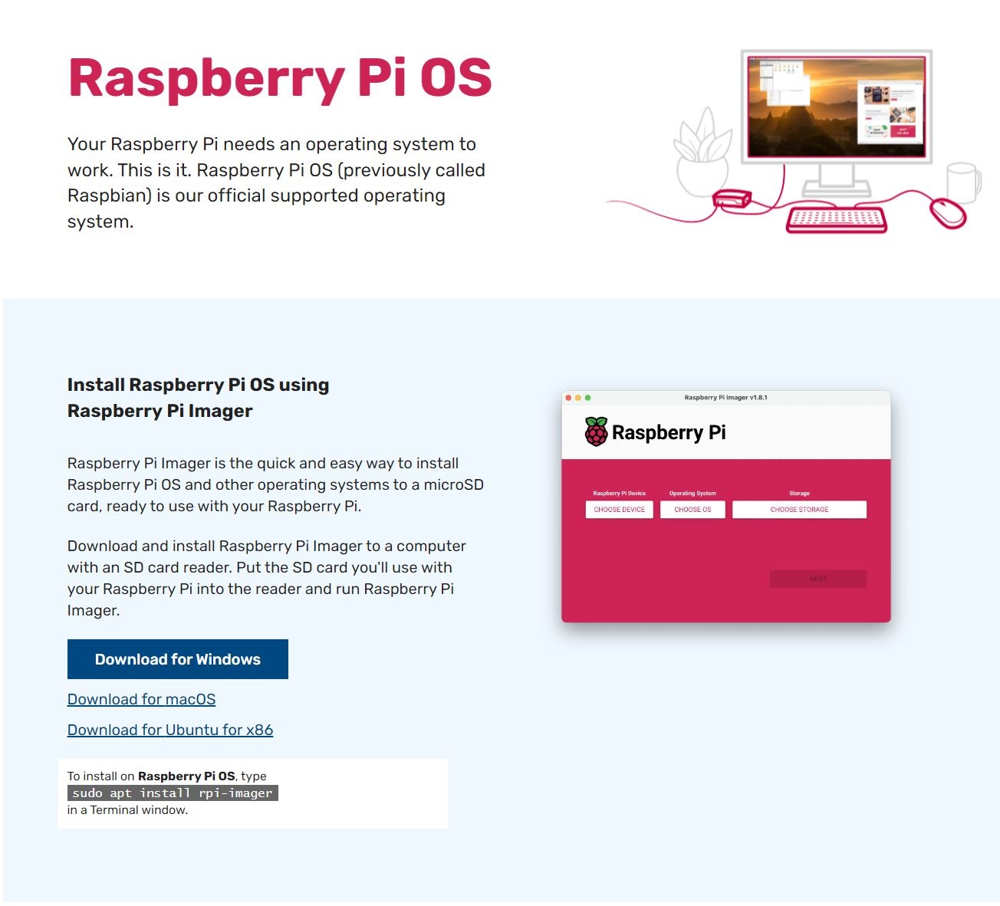
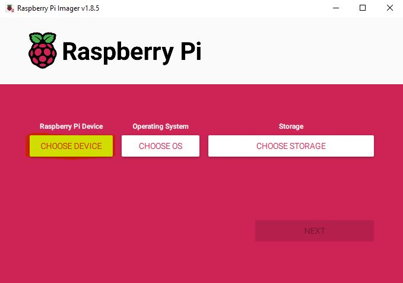
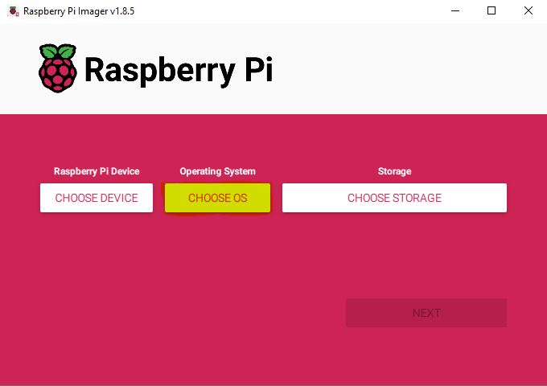
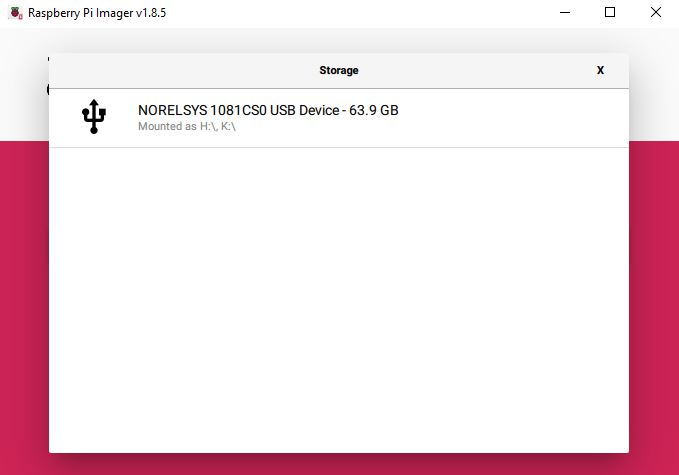

# PPPwn-For-Raspberry-Pi-Setup-Guide
A step by step guide in hopes of making installation as clear and easy as possible.  
Primaraly for Windows users 
This guide goes over how to set up [PI-Pwn](https://github.com/stooged/PI-Pwn?tab=readme-ov-file#pi-pwn)  
I will cover the setup for only Raspberry Pi devices.  
# Installing Raspberry Pi OS  
Download and install [Raspberry Pi Imager](https://www.raspberrypi.com/software/)  
   
**Choose the Pi device you are using**  
  
**Choose the OS**  
  
For this exploit it is best to use **Raspberry Pi OS Lite** foound in **Raspberry Pi OS (other)**  
  
(64-bit ver limited compatablity)
  
**Choose storage**  
  
**OS customisation**  
**Edit settings** Reccomended!   
  
**General**
**Set hostname**  
 This will be what you type in as your SSH hostname  
**Set usename and password**  
used to log into the pi :/   
Set them as anythign you want just remember them for later  
 

 

