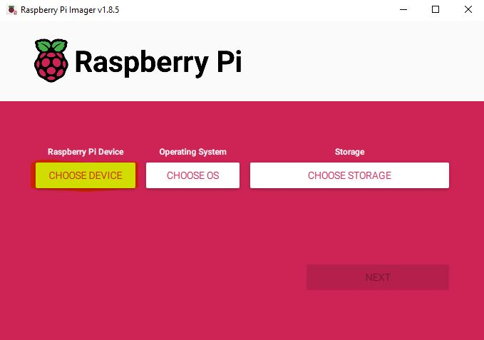
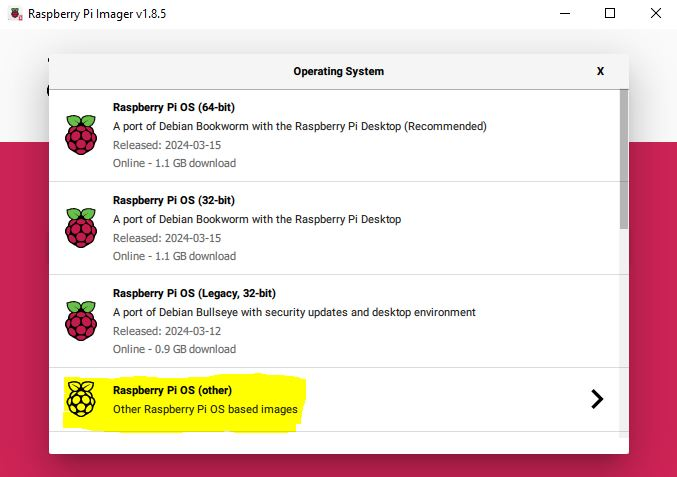
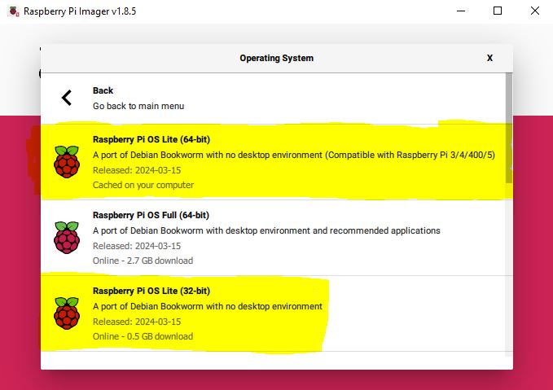

# " PPPwn-For-Raspberry-Pi-Setup-Guide"  
A step by step guide in hopes of making installation as clear and easy as possible.  
Primaraly for Windows users 
This guide goes over how to set up [PI-Pwn](https://github.com/stooged/PI-Pwn?tab=readme-ov-file#pi-pwn)  
I will cover the setup for only Raspberry Pi devices.  
# Downoading and installing Raspberry Pi OS  
Downlaod and install [Raspberry Pi Imager](https://www.raspberrypi.com/software/)  
   
**Choose the Pi device you are using**  
  
**Choose the OS**
  
For this exploit it is best to use **Raspberry Pi OS Lite** foound in **Raspberry Pi OS (other)**  
  
(64-bit ver limited compatablity)
  
**Choose storage**  

