# PPPwn-For-Raspberry-Pi-Setup-Guide
A step by step guide in hopes of making installation as clear and easy as possible    
Primaraly for Windows users   
This guide goes over how to set up [PI-Pwn](https://github.com/stooged/PI-Pwn?tab=readme-ov-file#pi-pwn)  
I will cover the setup for only Raspberry Pi devices    
# Installing Raspberry Pi OS    
Download and install [Raspberry Pi Imager](https://www.raspberrypi.com/software/)  
   
**Choose the Pi device you are using**  
  
**Choose the OS**  
  
For this exploit it is best to use **Raspberry Pi OS Lite** found in **Raspberry Pi OS (other)**  
  
(64-bit ver limited compatablity)
  
**Choose storage**  
  
**OS customisation**  
**Edit settings** Reccomended!   
  
**General**  
  
**Set hostname**      
 This will be what you type in as your SSH hostname (it will later be automatically changed to pppwn.local)     
**Set usename and password**  
Used to log into the pi :/   
Set them as anything you want just remember them for later  
**Configure wireless LAN**  
Let the Pi connect to your home Wi-Fi  
Pi Model Dependent!!!  
   
This will let you -   
1. Connect to your Pi via SSH.  
2. Forward an internet connection to your PS4 removing the need to unplug ethernet and change console internet settings.  
3. Update the script, payloads and etc.  
Tick  
Set locale settings  
It should auto to your correct region and kb layout if not set it manually     
  
**If your pi has no wireless capabilities you will have to use a second display for the instalation part of the script setup after that it will run automatically**  
    
**Services**  
  
Tick    
Enable SSH  
Then choose  
Use password authentication  
**Options**  
  
Untick everything and then press **Save**   
**Would you like to apply OS Customasation settings**  
Press Yes  
  
**All data on the storage device you chose will be erased**  
Confirm the device you chose is your SD Card then choose **Yes**  
  
Then wait while the Pi OS is written to the SD Card  
Some drive error windows may show up press on 'Cancel' and 'OK' for any of them  
  
Once the procces is finished some drive error windows may show up press on 'Cancel' and 'OK' for any of them you can then eject the SD Card and plug it into your Pi  
Power on your Pi By connecting it to your PS4 (which should also be turned on) and wait a few minutes for initial setup to auto complete (progress can be viewed over HDMI)    
# SSH into the Pi     
Not applicable if your Pi has no Wi-Fi Continue over HDMI   
**How to SSH into the Pi** 
# Download and install [PuTTY](https://www.chiark.greenend.org.uk/~sgtatham/putty/latest.html)      
Once installed   
It will show up on the bottom right  
    
Right click and open a new session  
      
  
Then Put in your previosly chosen Pi hostname   
  
Press Accept on the window that will open then put in the previosly set up username and passsword  
    
And you are now connected to the Pi    
    
# Installing the PI-pwn script by [stooged](https://github.com/stooged/PI-Pwn)  
One by one copy and run these commands (paste into ssh terminal with right click)   
```
sudo apt update
```  
```
sudo apt install git -y 
```  
```
sudo rm -f -r PI-Pwn
```    
```
git clone https://github.com/stooged/PI-Pwn
```    
```
cd PI-Pwn
```    
```
sudo cp -r PPPwn /boot/firmware/
```  
```
cd /boot/firmware/PPPwn
```  
```
sudo chmod 777 *
```  
```
sudo bash install.sh
```   
  
# The Terminal will then ask you some setup questions  
  

1. Do you want to enable the option to use the python(slower) PPPwn(Y|N)?:   
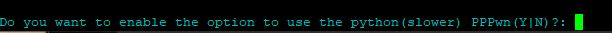   
2. Do you want to install the FTP server (Y|N)?:   
     
If the pi pwn was setup to allow internet access you can use the ftp, klog, and binloader servers on the console
Your pi must be also connected to your home network via wifi or a second ethernet connection
To connect to the servers from your pc just connect to the raspberry pi ip on your network and all requests will be forwarded to the console   
Do you want to set the root account password  
To use FTP you must set the root account password so you can login to the ftp server with full write permissions  
3. Do you want to set the root account password  
(Y|N)?:    
Choose y and set the account password remember it for later use  
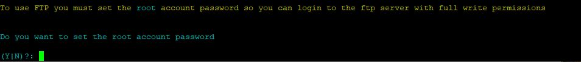 
4. Do you want to setup SAMBA share (Y|N)?:     
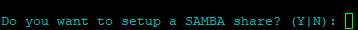    
From  [Wikipedia](https://en.wikipedia.org/wiki/Samba_(software))      
Samba allows file and print sharing between computers running Microsoft Windows and computers running Unix. It is an implementation of dozens of services and a dozen protocols, including:    
NetBIOS over TCP/IP (NBT)   
SMB (known as CIFS in some versions)   
Samba supports POSIX extensions for CIFS/SMB. The initial extension was CIFS VFS (CAP_UNIX) from 2004, which has been somewhat superseded by SMB3.    
DCE/RPC or more specifically, MSRPC, the Network Neighborhood suite of protocols    
A WINS server also known as a NetBIOS Name Server (NBNS)    
The NT Domain suite of protocols which includes NT Domain Logons   
Security Account Manager (SAM) database   
Local Security Authority (LSA) service   
NT-style printing service (SPOOLSS)   
NTLM    
Active Directory Logon using modified versions of Kerberos and LDAP    
DFS server       
    
	
Additionally  
If you setup samba to access the pppwn folder for the exploit files you can access the drive on...
\\pppwn.local\pppwn
or
smb:\\pppwn.local\pppwn

The share has no user/password required to access it.   
    
	
5.  Do you want to use the old python version of pppwn, it is much slower (Y|N)?:    (you will not be asked this if at the first question you chose **n**)     
Choose to enable it at this point if you want to actively use it  (here i chose not to)      
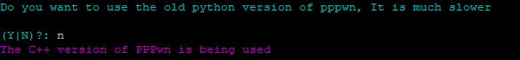     
6. Do you want to use Goldhen if it is available for the selected firmware (Y|N)?:        
      
6. Do you want to set a PPPoE username and passsord ?  If you select **N** then the defaults will be used   
Reccomended to choose **N** if you choose **Y** please remember them for later  
        
7. Do you want to detect console shutdown and restart PPPwn (Y|N)?:    
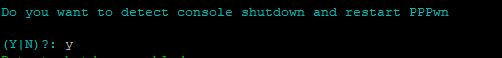     
8. Do you want the console to connect to the internet after PPPwn? (Y|N)?:   
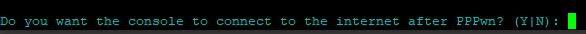      
9. Are you using a usb to ethernet adapter    
For Pi's with no ethernet port choose **Y** or if you are using a Pi with an ethernet port choose **N**  
     
10. Do you want to try and detect if goldhen is running and skip running pppwn if found, useful for rest mode   
(Y|N)?:   
    
11. Do you want pppwn to run in verbose mode    
(Y|N)?:         
What is verbose ?      
From  [Wikipedia](https://en.wikipedia.org/wiki/Verbose_mode)     
In computing, Verbose mode is an option available in many computer operating systems and programming languages that provides additional details as to what the computer is doing and what drivers and software it is loading during startup or in programming it would produce detailed output for diagnostic purposes thus makes a program easier to debug.               
         
Here i chose y.    
12. Do you want to change the timeout for pppwn if it hangs, the default is 5 (minutes)  
(Y|N)?:   
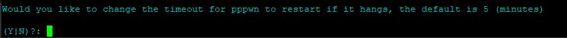
12. Would you like to change the firmware version being used, the default is 11.00  
    
The only compaible firmwares for Goldhen at the time of writing are 11.00, 10.01, 10.00, 9.60, 9.00,  all other firmwares 7.00, to 11.0, are available as PS4hen VTX which has less features as shown below
    
13. Would you like to change the pi lan interface, the default is eth0 choose **N** to continue or **Y** to change it  
        
15. Do you want to use the original ipv6 address that was used in pppwn    
(Y|N)?:            
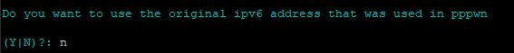        
It is highly reccomended to choose N here when we worked on the [fix for troubled consoles](https://github.com/TheOfficialFloW/PPPwn/pull/66)     
We made sure it works with many consoles good and troubled       
16. Would you like to change the hostname, the default is pppwn (Y|N)?:                          	
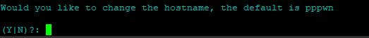                
The Pi will then reboot       

Connect a Ethernet Cable to the PS4 and Pi     
# NOTICE!  
# For future SSH access   
# After reboot the Pi's previosly set hostname will be changed to *pppwn.local* the username and password will stay the same  unless changed     
# Putting Goldhen on a USB      
Download [Goldhen](https://github.com/GoldHEN/GoldHEN/releases/tag/2.4b17) By SiSTR0  (Skip if you have a Pi 4 or 5 and chose **Y** to have it act as a virtual drive (Pi has to be connected to PS4 USB port)     
And put the *goldhen.bin* on a USB formatted in exFAT or FAT32 and plug it into your PS4.

Windows has several built-in disk format tools that can be used to format a USB drive.  
**Windows File Explorer** To do this, open file explorer then right-click on the drive and select “Format”.  
**Windows Disk Management** This is a built-in utility that allows you to format a disk or a partition. To access it, go to Control Panel > System and Security > Administrative Tools > Computer Management. In the left pane, under Storage, select Disk Management. Right-click the volume you want to format and select Format.

Or you can use a 3rd party option like [partition wizard](https://www.partitionwizard.com/)  

# Setting up the PS4 internet connection  
On your PS4  
1. Go to **Settings** and then **Network**   
2. Select **Set Up Internet connection** and choose Use a **LAN Cable**  
3. Choose **Custom** setup and choose **PPPoE** for IP Address Settings  
4. Put in *ppp* as **Username** and ***Password***  (Or the previosly chosen Username and Password if defaults were changed)  
5. Choose **Automatic** for *DNS Settings* and *MTU Settings*
6. Choose **Do not use** for *Proxy Server*   
7. Stay at the **Test Internet connection** Screen  

# Executing the exploit   
Connect a Ethernet Cable to the PS4 and Pi  
On your PS4 press **Test Internet connection**  
It should find an IP and then the Pi will take over and automatically try to exploit 
If this fails  
Restart the PS4 the Pi will shutdown and Restart with it  
Go to the home menu it should start automatically attempting the exploit  

# WEBSERVER PREVIEW    
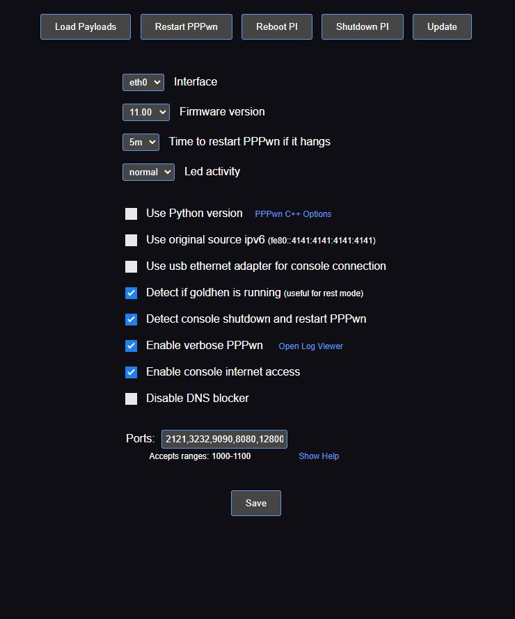   
**Load Payloads**    
Allows you to put payloads onto a usb inside a folder called *payloads* and plug it into the Pi to load them they will then show up when you press on **Load Payloads**   
Goldhen binserver must be enabled  
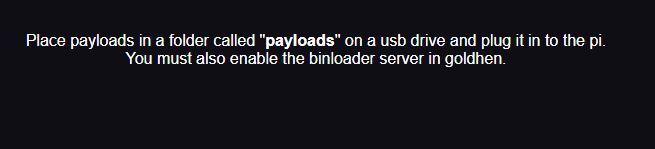  
         
**Restart PPPwn**    
    
If the exploit is stuck and not working use this to restart it  
  
  
**Reboot Pi**   
1. Restarts the Pi    
2. Resets the PPPwn script   
3. Resets ps4 internet connection    
  
  
**Shutdown Pi**    
1. Stops the exploit 
2. Stops intenet to the PS4 if you chose **Y** on > 1. Do you want the console to connect to the internet after PPPwn?   
3. Turns off the Pi but LED lights will still be on due to it being plugged into power if PS4 is turned on or if connected to wall outlet  
**To turn off the LED's see [Turning off LED's](https://github.com/DrYenyen/PPPwn-Setup-Guide-For-Raspberry-Pi#turning-off-leds)  or use the dropdown menu    

**UPDATE**      
Press it to update to the latest Pi-PPPwn version       

**Interface**  
Allows you to change the ethernet adapter that is being used      

**Firmaware Version**     
Allows you to change the exploit firmware version for your console      
    
**Time to restart PPPwn if it hangs**     
Use the drop down menu to change in minutes    	

**Use Python Version**    
Use the python version or change PPPwn C++ Options    
    
**Use original ipv6**     
Highly reccomended to keep it unchecked    

**Use usb ethernet adapter for console connection**       
Allows you to change from using the ethernet port on your Pi to a USB port (Requires usb to ethernet adapter)      
    
**Detect if goldhen is running (useful in rest mode)**     
     
**Enable verbose PPPwn**    
Allows you to view the termianl output   
  
**Detect Console Shutdown and restart PPPwn**  
Restarts the PPPwn script after the console has been turned off (only works if the Pi is set to always be turned on)  
  
**Enable console internet access**     
Gives the console access to the internet needed for ftp,samba and etc   

**Disable DNS blocker**       
I believe 
  
# Updating [PI-Pwn](https://github.com/stooged/PI-Pwn?tab=readme-ov-file#pi-pwn)  
**Updating via SHH or Manually through the Pi**
The Pi needs to be powered on  
Write in or copy and paste the following commands    
```
sudo apt update
```  
```
sudo apt install git -y 
```  
```
sudo rm -f -r PI-Pwn 
``` 
```
sudo systemctl stop pipwn
```    
```
git clone https://github.com/stooged/PI-Pwn
```  
```
sudo mkdir /boot/firmware/
```  
```
cd PI-Pwn
```  
```
sudo cp -r PPPwn /boot/firmware/
```  
```
cd /boot/firmware/PPPwn
```  
```
sudo chmod 777 *
```  
```
sudo bash install.sh
```     
  
The Terminal/CMD/Putty will ask  
Config found, Do you want to change stored settings **Y** or **N**   
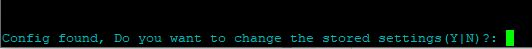  
Choose **Y** if you want to change previosly applied settings during  [The Terminal will then ask you some setup questions](https://github.com/DrYenyen/PPPwn-Setup-Guide-For-Raspberry-Pi#the-terminal-will-then-ask-you-some-setup-questions) or choose **N** if your current settings are satisfactory  
  
  
Alternatively you can power off the Pi plug the SD Card into your PC or Laptop then Download the latest [PI-Pwn](https://github.com/stooged/PI-Pwn?tab=readme-ov-file#pi-pwn) files and copy the *PPPwn* folder found inside *PI-Pwn-main* onto your SD Card and overwrite the old files  
# FAQ     
# What is the latest exploitable firmware?     
**11.00**    
Will it work on *11.02*? **Nope**  
What changed in *11.02* to make it stop working? **The exploit got patched ;)**    
# Can i downgrade if i am on *11.02-11.50*?   
Downgrading can be done under certain conditions      
1. You have not initialised the console on the current firmware    
2. You have not reinstalled system firmware to fix Hard Drive issues    
3. You have not replaced your Hard Drive and reinstalled the current system firmware    
4. Your Syscon must be A0X-COLX (X=Digits on your Syscon)    
**You can watch a full guide by [MODDED WARFARE](https://www.youtube.com/watch?v=JxeSP1PJtEs&t=764s)**     

# pppwn.local
Q: Why can't I connect to pppwn.local on my phone?  
A: Because you're not on the same network as the raspberry pi, turn off your VPN and connect to wifi.

# GOLDHEN PPPWN support 
**Current supported versions**   
*9.00*  *9.60* *10.00 and 10.01* *11.00*      
         
# PS4HEN PPPWN support 
*7.00* to *11.00*   excluding already compatible goldhen firmwares   
Although it has less features than goldhen    
          
# Can i do it over Wi-Fi instead of using an ethernet cable  
**Nope**     
  
# Turning off LED's   
You can either use the Web interface or   

Put the sd card into your pc and find config.txt  
  
Add these lines to the bottom for the leds you want to disable:  
  
Disable Power LED (Red)  
  
dtparam=pwr_led_activelow=off  
  
Disable Activity LED (Green)  
  
dtparam=act_led_trigger=none  
dtparam=act_led_activelow=off  
  
Disable LAN LEDs  
  
dtparam=eth_led0=14  
dtparam=eth_led1=14    
  
Credit to *stooged*
  
# FULL CREDIT TO [stooged](https://github.com/stooged)    
More info on his GitHub https://github.com/stooged/PI-Pwn     
    
# Other guides            
# 1. [Guides Thread](https://github.com/DrYenyen/Guide-Links-For-PS4)     
# 2. [How to use a GUI tool to run PPPwn on Windows](https://github.com/DrYenyen/PPPwnGo-Guide)           
# 3. [How to manually update PS4 firmware](https://github.com/DrYenyen/PS4-Firware-Update-Guide)                        
# 4. [How to install FPKGS](https://github.com/DrYenyen/How-To-Install-PS4-FPKGS)                        
# 5. [How to set up PPPwn on a OpenWRT compatible router(by FalsePhilosopher)](https://github.com/FalsePhilosopher/PPPwnWRT)                     	 
# 6. [How-To-Use-Cheats-and-Patches-On-PS4](https://github.com/DrYenyen/How-To-Use-Goldhen-Cheats-and-Patches-On-PS4)     

