# PPPwn-For-Raspberry-Pi-Setup-Guide
A step by step guide in hopes of making installation as clear and easy as possible    
Primaraly for Windows users   
This guide goes over how to set up [PI-Pwn](https://github.com/stooged/PI-Pwn?tab=readme-ov-file#pi-pwn)  
I will cover the setup for only Raspberry Pi devices    
# Installing Raspberry Pi OS    
Download and install [Raspberry Pi Imager](https://www.raspberrypi.com/software/)  
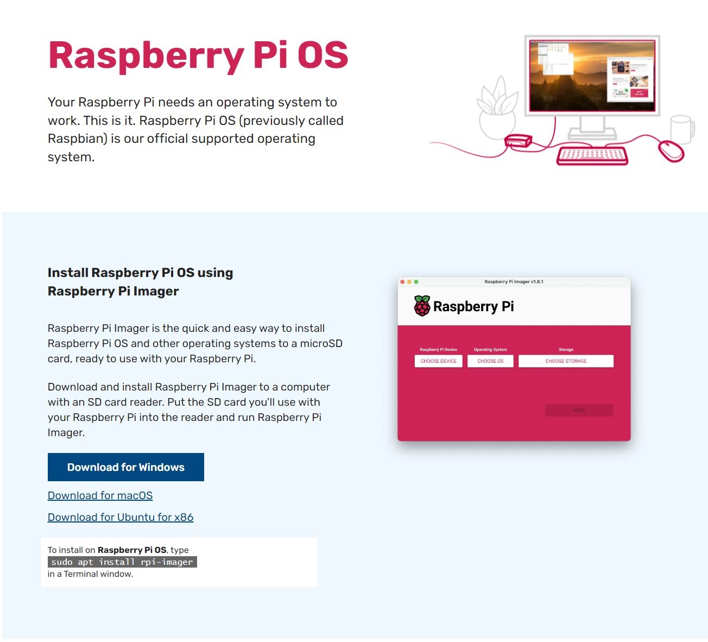   
**Choose the Pi device you are using**  
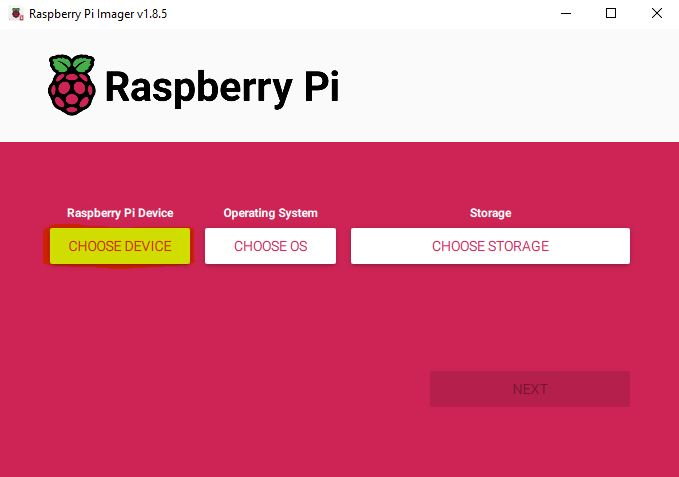  
**Choose the OS**  
  
For this exploit it is best to use **Raspberry Pi OS Lite** found in **Raspberry Pi OS (other)**  
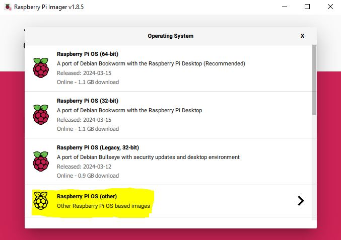  
(64-bit ver limited compatablity)
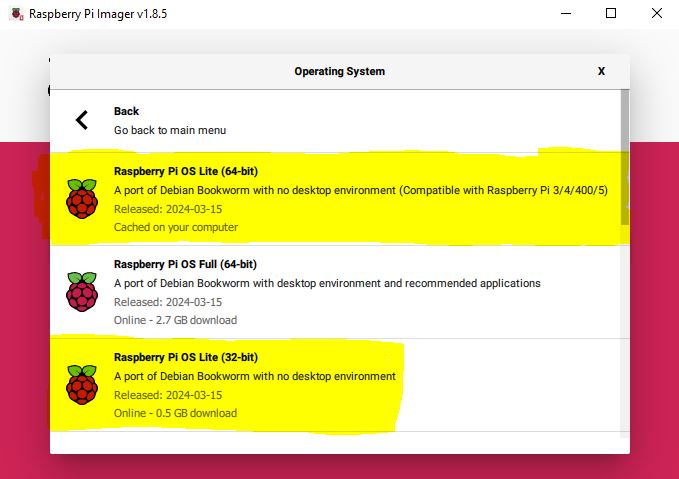  
**Choose storage**  
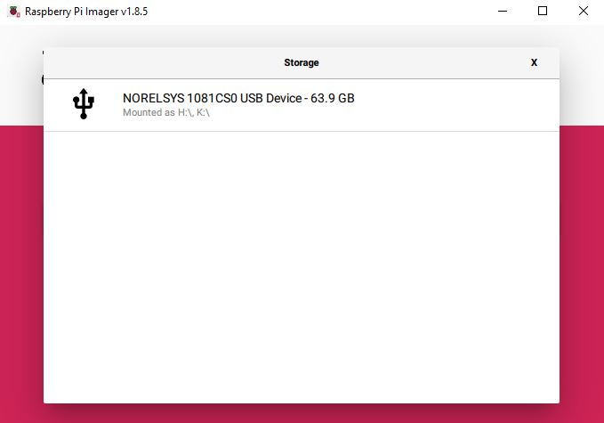  
**OS customisation**  
**Edit settings** Reccomended!   
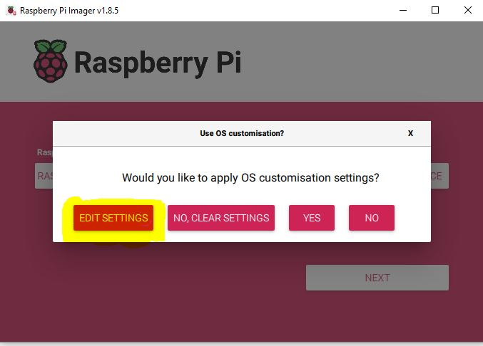  
**General**  
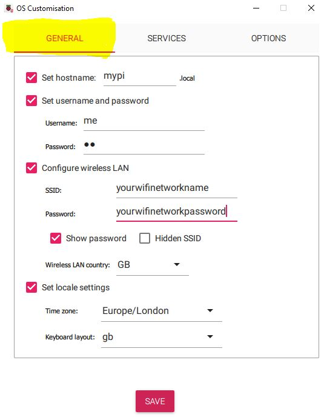  
**Set hostname**      
 This will be what you type in as your SSH hostname   
**Set usename and password**  
Used to log into the pi :/   
Set them as anything you want just remember them for later  
**Configure wireless LAN**  
Let the Pi connect to your home Wi-Fi  
Pi Model Dependent!!!  
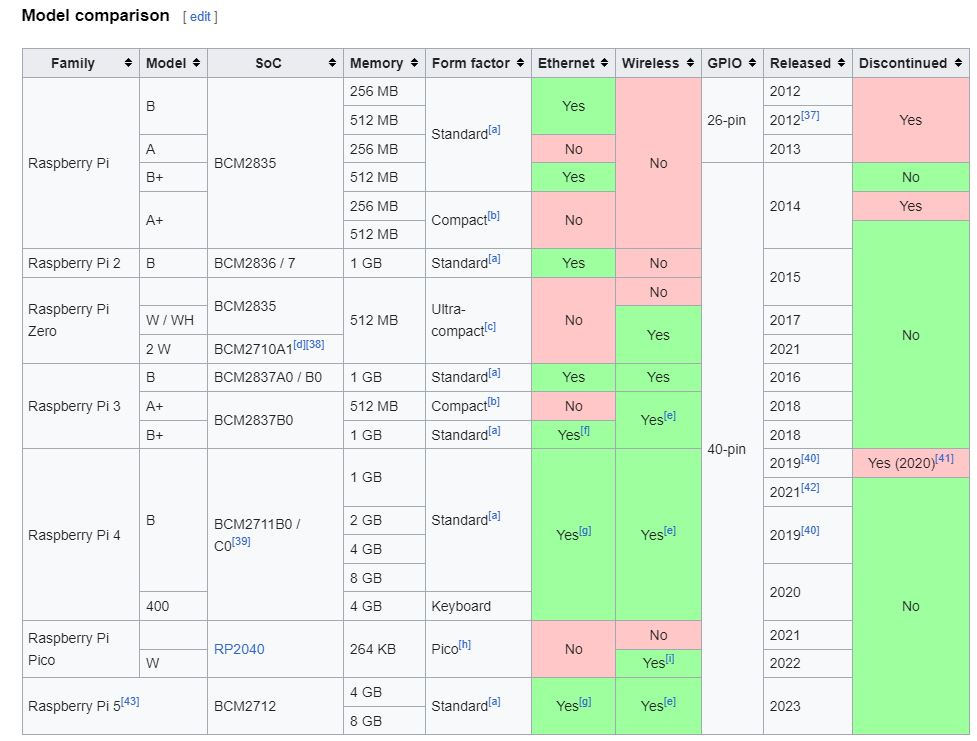   
This will let you -   
1. Connect to your Pi via SSH.  
2. Forward an internet connection to your PS4 removing the need to unplug ethernet and change console internet settings.  
3. Update the script, payloads and etc.  
Tick  
Set locale settings  
It should auto to your correct region and kb layout if not set it manually     
  
**If your pi has no wireless capabilities you will have to use a second display for the instalation part of the script setup after that it will run automatically**  
    
**Services**  
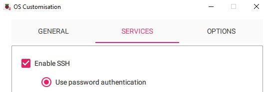  
Tick    
Enable SSH  
Then choose  
Use password authentication  
**Options**  
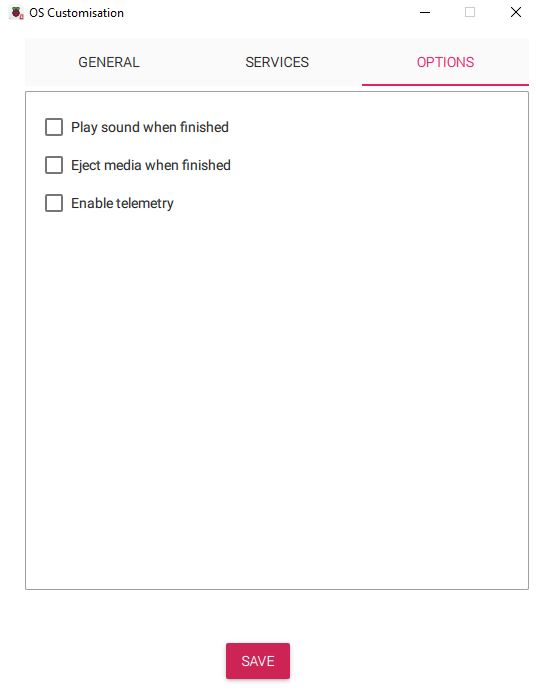  
Untick everything and then press **Save**   
**Would you like to apply OS Customasation settings**  
Press Yes  
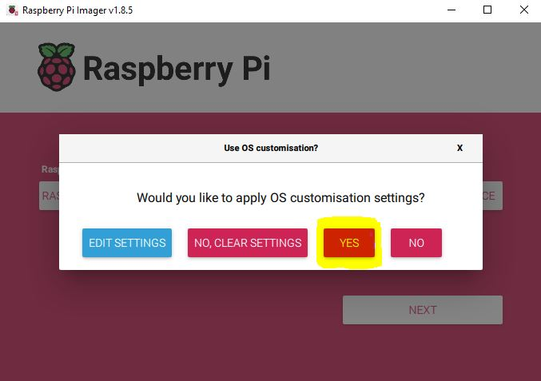  
**All data on the storage device you chose will be erased**  
Confirm the device you chose is your SD Card then choose **Yes**  
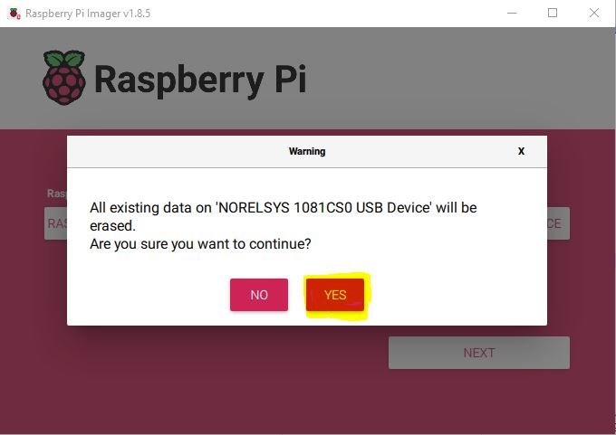  
Then wait while the Pi OS is written to the SD Card  
Some drive error windows may show up press on 'Cancel' and 'OK' for any of them  
  
Once the procces is finished some drive error windows may show up press on 'Cancel' and 'OK' for any of them you can then eject the SD Card and plug it into your Pi  
Power on your Pi By connecting it to your PS4 (which should also be turned on) and wait a few minutes for initial setup to auto complete (progress can be viewed over HDMI)    
# SSH into the Pi     
Not applicable if your Pi has no Wi-Fi Continue over HDMI   
**How to SSH into the Pi** 
# Download and install [PuTTY](https://www.chiark.greenend.org.uk/~sgtatham/putty/latest.html)      
Once installed   
It will show up on the bottom right  
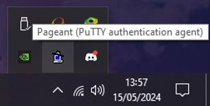    
Right click and open a new session  
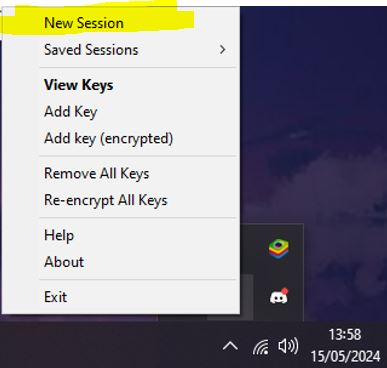      
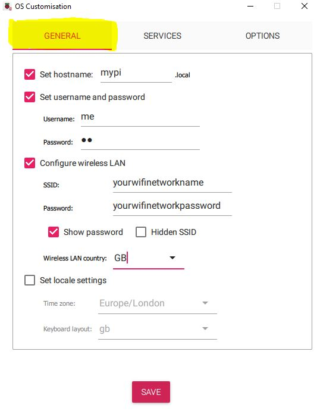  
Then Put in your previosly chosen Pi hostname   
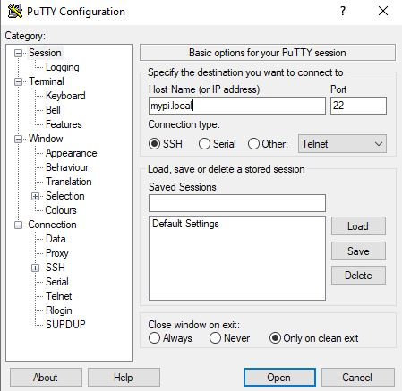  
Press Accept on the window that will open then put in the previosly set up username and passsword  
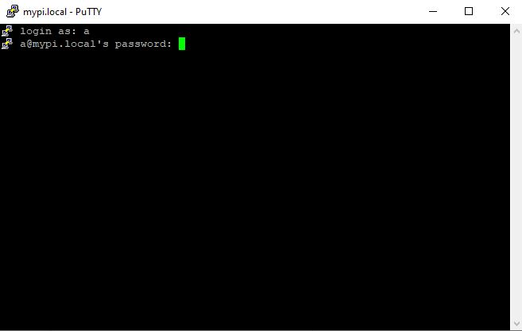    
And you are now connected to the Pi    
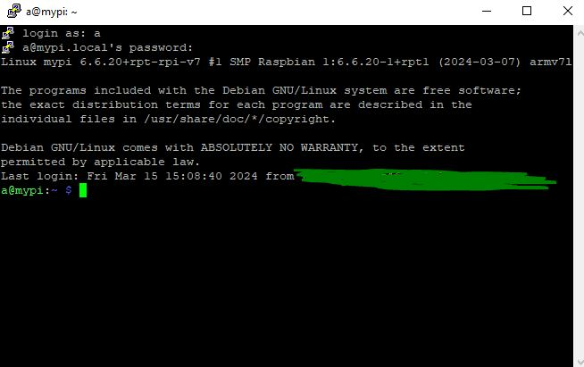    
# Installing the PI-pwn script by [stooged](https://github.com/stooged/PI-Pwn)  
One by one copy and run these commands (paste into ssh termianl with right click) 
```
sudo apt update
```  
```
sudo apt install git -y 
```  
```
sudo rm -f -r PI-Pwn
```    
```
git clone https://github.com/stooged/PI-Pwn
```  
```
cd PI-Pwn
```  
```
sudo cp -r PPPwn /boot/firmware/
```  
```
cd /boot/firmware/PPPwn
```  
```
sudo chmod 777 *
```  
```
sudo bash install.sh
```

Or use this one line install script provided by [FalsePhilosopher](https://github.com/FalsePhilosopher)
```
sudo wget -q -O - https://github.com/DrYenyen/PPPwn-Setup-Guide-For-Raspberry-Pi/raw/main/install.sh | bash
```
The Terminal will then ask you some setup questions  
  

  
1. Do you want the console to connect to the internet after PPPwn?  
Only for compatible Pi's which are connected to your home Wi-Fi network      
Chosing **Y** for this option means your PS4 will have internet access and the Pi will not turn off you will be able to access the webserver http://pppwn.local [**WEBSERVER PREVIEW**](https://github.com/DrYenyen/PPPwn-Setup-Guide-For-Raspberry-Pi?tab=readme-ov-file#webserver-preview) for future control of the Pi after a successful pwn run you will also **NOT** be asked  > 3. Do you want the Pi to shutdown after pwn success  
Choosing **Y** for this option you **WILL** be asked >  2. Do you want to set a PPPoE username and passsword ?  
If you choose **N** you **WILL** be asked > 3. Do you want the Pi to shutdown after pwn success  
 
2. Do you want to set a PPPoE username and passsord ?  If you select **N** then the defaults will be used   
Reccomended to choose **N** if you choose **Y** please remember them for later  
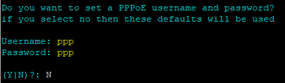       
3. Do you want the Pi to shutdown after pwn success    
Choose **N** if you want to be able to access the webserver  http://pppwn.local [**WEBSERVER PREVIEW**](https://github.com/DrYenyen/PPPwn-Setup-Guide-For-Raspberry-Pi?tab=readme-ov-file#webserver-preview)  for future control of the Pi if not choose **Y**    
  
4. Are you using a usb to ethernet adapter    
For Pi's with no ethernet port choose **Y** or if you are using a Pi with an ethernet port choose **N**  
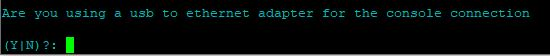  
5. Do you want to use the old python version of pppwn, It is much slower  
Choose **N** :/  
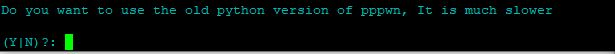   
6. Would you like to change the firmware version being used, the default is 11.00  
The only other compaible firmware at the time of writing is 9.00 so choose **Y** and type in 9.00 if that is the firmware you are using or simply choose **N** if you are on 11.00  
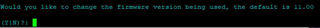 
7. Would you like to change the pi lan interface, the default is eth0 choose **N** to continue or **Y** to change it  
   
The Pi will then reboot  
Connect a Ethernet Cable to the PS4 and Pi  
# NOTICE!  
# For future SSH access  
# After reboot the Pi's previosly set hostname will be changed to *pppwn.local* the username and password will stay the same   
# Putting Goldhen on a USB  
Download [Goldhen](https://github.com/GoldHEN/GoldHEN/releases/tag/2.4b17) By SiSTR0   
And put the *goldhen.bin* on a USB formatted in exFAT or FAT32 and plug it into your PS4.

Windows has several built-in disk format tools that can be used to format a USB drive.  
**Windows File Explorer** To do this, open file explorer then right-click on the drive and select “Format”.  
**Windows Disk Management** This is a built-in utility that allows you to format a disk or a partition. To access it, go to Control Panel > System and Security > Administrative Tools > Computer Management. In the left pane, under Storage, select Disk Management. Right-click the volume you want to format and select Format.

Or you can use a 3rd party option like [partition wizard](https://www.partitionwizard.com/)  

# Setting up the PS4 internet connection  
On your PS4  
1. Go to **Settings** and then **Network**   
2. Select **Set Up Internet connection** and choose Use a **LAN Cable**  
3. Choose **Custom** setup and choose **PPPoE** for IP Address Settings  
4. Put in *ppp* as **Username** and ***Password***  (Or the previosly chosen Username and Password if defaults were changed)  
5. Choose **Automatic** for *DNS Settings* and *MTU Settings*
6. Choose **Do not use** for *Proxy Server*   
7. Stay at the **Test Internet connection** Screen  

# Executing the exploit   
Connect a Ethernet Cable to the PS4 and Pi  
On your PS4 press **Test Internet connection**  
It should find an IP and then the Pi will take over and automatically try to exploit 
If this fails  
Restart the PS4 the Pi will shutdown and Restart with it  
Go to the home menu it should start automatically attempting the exploit  

# WEBSERVER PREVIEW    
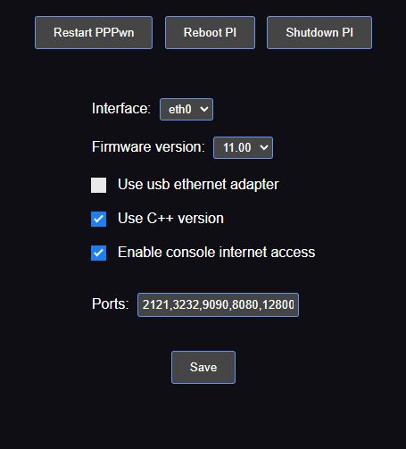     
**Restart PPPwn**  
    
If the exploit is stuck and not working use this to restart it  
  
  
**Reboot Pi**   
1. Restarts the Pi    
2. Resets the PPPwn script   
3. Resets ps4 internet connection if you chose **Y** on > 1. Do you want the console to connect to the internet after PPPwn?  
  
  
**Shutdown Pi**    
1. Stops the exploit 
2. Stops intenet to the PS4 if you chose **Y** on > 1. Do you want the console to connect to the internet after PPPwn?   
3 Turns off the Pi but LED lights will still be on due to it being plugged into power if PS4 is turned on or if connected to wall outlet  
Useful if you are booting the console from rest mode and already have GOLDHEN activated  
Requires power to be disabled and then enable to boot the Pi again  
    
**Interface**  
Allows you to change the ethernet adapter that is being used  
    
**Firmaware Version**     
Allows you to change between stage2 payload for 9.00 and 11.00 (11.00 Default unless changed during > 6. Would you like to change the firmware version being used, the default is 11.00   
This allows you to use 1 Pi between consoles with different firmware versions (Only 9.00 and 11.00 supported at this time)  
**Use usb ethernet adapter**    
Allows you to change from using the ethernet port on your Pi to a USB port (Requires usb to ethernet adapter)  
**Use C++ Version** 
If during > 5. Do you want to use the old python version of pppwn, It is much slower. You chose **Y** you can now change from Python to C++)
**Enable console internet access**  
If during > 1. Do you want the console to connect to the internet after PPPwn? You chose **N** you can now change it and give your PS4 internet access through the Pi **Notice** this stops the Pi from Turning off  
**Ports** 
No changes are needed   
AFter you have finished tweaking your settings press **Save** **Excluding Restart PPPwn**, **Reboot Pi** and **Shutdown Pi**  
    
# FAQ     
# What is the latest exploitable firmware?    
**11.00**    
Will it work on *11.02*? **Nope**  
What changed in *11.02* to make it stop working? **The exploit got patched ;)**    
# Can i downgrade if i am on *11.02-11.50*?   
Downgrading can be done under certain conditions      
1. You have not initialised the console on the current firmware    
2. You have not reinstalled system firmware to fix Hard Drive issues    
3. You have not replaced your Hard Drive and reinstalled the current system firmware    
4. You have not downloaded the network update to 100%    
5. Your Syscon must be A0X-COLX (X=Digits on your Syscon)    
**You can watch a full guide by [MODDED WARFARE](https://www.youtube.com/watch?v=JxeSP1PJtEs&t=764s)**     
  
# GOLDHEN PPPWN support 
**Current supported versions**   
*9.00*  
*11.00*    
*10.xx* in development  
  
# Can i do it over Wi-Fi instead of using an ethernet cable  
**Nope**   
  
# FULL CREDIT TO [stooged](https://github.com/stooged)    
More info on his GitHub https://github.com/stooged/PI-Pwn  


