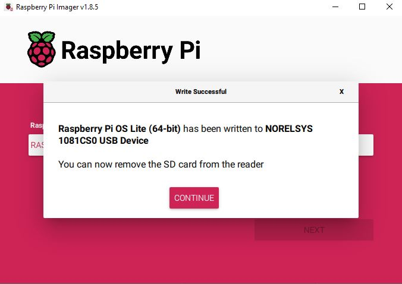

# PPPwn-For-Raspberry-Pi-Setup-Guide
A step by step guide in hopes of making installation as clear and easy as possible.  
Primaraly for Windows users 
This guide goes over how to set up [PI-Pwn](https://github.com/stooged/PI-Pwn?tab=readme-ov-file#pi-pwn)  
I will cover the setup for only Raspberry Pi devices.  
# Installing Raspberry Pi OS  
Download and install [Raspberry Pi Imager](https://www.raspberrypi.com/software/)  
   
**Choose the Pi device you are using**  
  
**Choose the OS**  
  
For this exploit it is best to use **Raspberry Pi OS Lite** foound in **Raspberry Pi OS (other)**  
  
(64-bit ver limited compatablity)
  
**Choose storage**  
  
**OS customisation**  
**Edit settings** Reccomended!   
  
**General**  
  
**Set hostname**    
 This will be what you type in as your SSH hostname 
**Set usename and password**  
used to log into the pi :/   
Set them as anything you want just remember them for later  
**Configure wireless LAN**  
Let the Pi connect to your home Wi-Fi  
Pi Model Dependant!!!  
   
This will let you -   
1. Connect to your Pi via SSH.  
2. Forward an internet connection to your PS4 removing the need to unplug ethernet and change console internet settings.  
3. Update the script, payloads and etc.  
Tick  
Set locale settings  
It should auto to your correct region and kb layout if not set it manually     
  
**If your pi has no wireless capabilities you will have to use a second display for the instalation part of the script setup after that it will run automatically**  
    
**Services**  
  
Tick    
Enable SSH  
Then choose  
use password authentication  
**Options**  
  
Untick everything and then press **Save**   
**Would you like to apply OS Customasation settings**  
Press Yes  
  
**All data on the storage device you chose will be erased**  
Confirm the device you chose is your SD Card then choose **Yes**  
  
Then wait while the Pi OS is written to the SD Card  
Some drive error windows may show up press on 'Cancel' and 'OK' for any of them  
  
Once the procces is finished some drive error windows may show up press on 'Cancel' and 'OK' for any of them you can then eject the SD Card and plug it into your Pi  
Power on your Pi and wait a few minutes for initial setup to auto complete(progress can be viewed over HDMI)    
# SSH into the Pi  
Not applicable if your Pi has no Wi-Fi Continue over HDMI   
**How to SSH into the Pi** 
# Download and install  
[PuTTY](https://www.chiark.greenend.org.uk/~sgtatham/putty/latest.html)    
Once installed   
It will show up on the bottom right  
    
Right click and open a new session  
      
  
Then Put in your previosly chosen Pi hostname   
  
Press Accept on the window that will open then put in the previosly set up username and passsword  
    
And you are now connected to the Pi    
    
# Installing the PI-pwn script by [stooged](https://github.com/stooged/PI-Pwn)  
One by one run these commands  
```
sudo apt update
```  
```
sudo apt install git -y 
```  
```
sudo rm -f -r PI-Pwn
```    
```
git clone https://github.com/stooged/PI-Pwn
```  
```
cd PI-Pwn
```  
```
sudo cp -r PPPwn /boot/firmware/
```  
```
cd /boot/firmware/PPPwn
```  
```
sudo chmod 777 *
```  
```
sudo bash install.sh
```  


 


